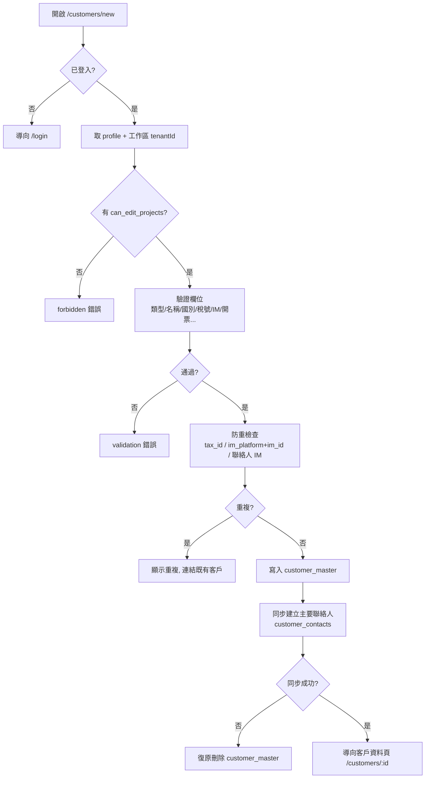
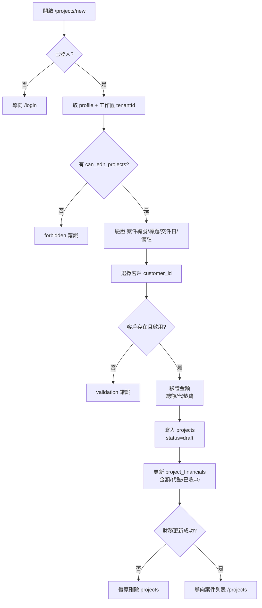
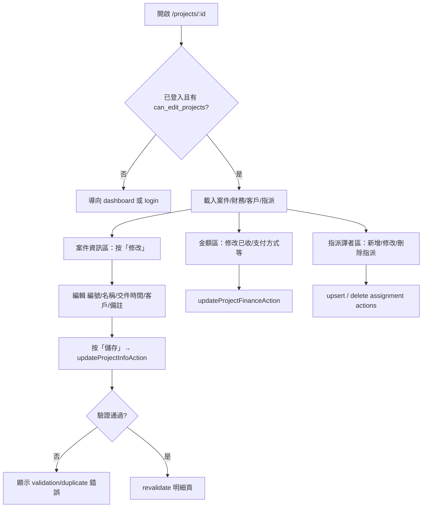
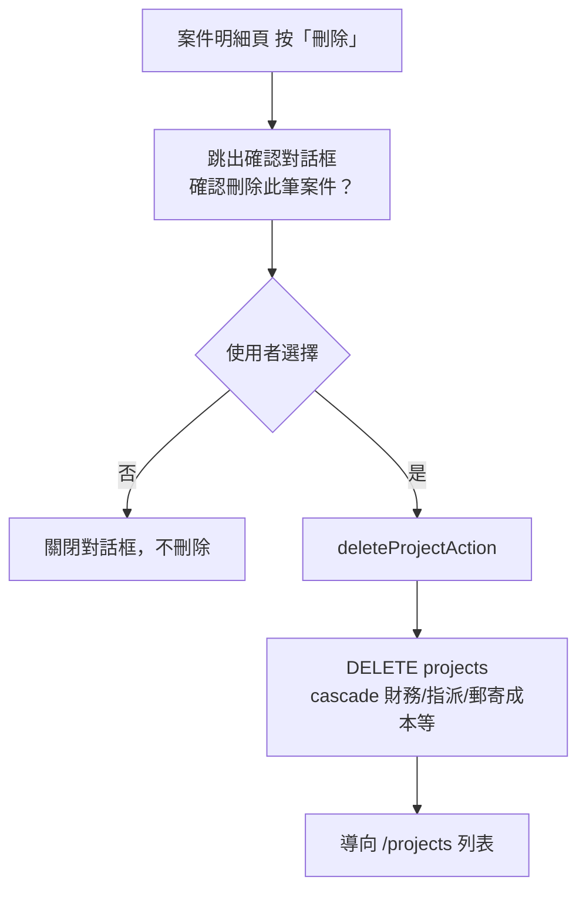
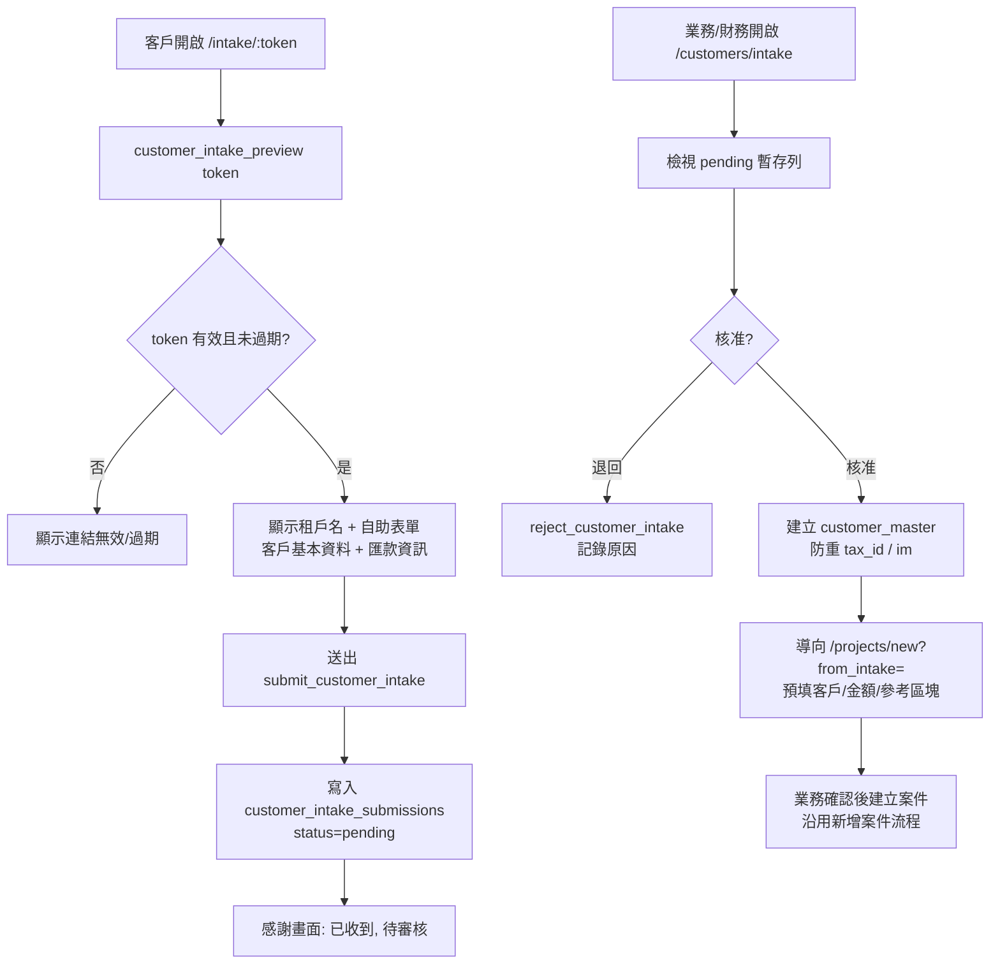

# 新增客戶 / 新增案件 / 案件維護 流程圖

> 依現行程式碼整理。最後更新：**2026-06-19**。
>
> | 主題 | 主要程式路徑 |
> |------|----------------|
> | 新增客戶 | `customers/new/actions.ts` → `createCustomerAction` |
> | 新增案件 | `projects/new/actions.ts` → `createProjectAction` |
> | 案件明細／修改／刪除 | `projects/[id]/page.tsx`、`project-info-editor.tsx`、`actions.ts` |
> | 客戶 Intake（V1） | `intake/[token]/`、`customers/intake/`、`actions/customer-intake.ts` |
>
> 「客戶自助建檔（Intake）」**全局大門口模式 V1 已實作**；設計細節與待辦見 `docs/CUSTOMER_INTAKE_DESIGN.md`。

## 1. 新增客戶流程（現行）

來源：`src/app/[locale]/(app)/customers/new/actions.ts` → `createCustomerAction`

重點：
- 權限門檻為 `can_edit_projects`（或 super_admin）。
- 租戶由後端依登入工作區帶入，前端不傳 `tenant_id`。
- 建立主檔後會同步一筆主要聯絡人到 `customer_contacts`；同步失敗會回滾刪除主檔。

## 2. 新增案件流程（現行）

來源：`src/app/[locale]/(app)/projects/new/actions.ts` → `createProjectAction`

重點：
- 案件**必須先選一個既有且啟用的客戶**（`projects.customer_id` → `customer_master`）。
- 因此流程順序固定為「**先有客戶 → 才能建案件**」。
- 可選填 **`projects.notes`**（案件備註）；從 Intake 轉正時可帶入預填與唯讀參考區塊。
- 建立案件後更新對應的 `project_financials`（金額、代墊費、已收款=0）；更新失敗會回滾刪除案件。

## 3. 案件明細與修改流程（現行）

來源：`src/app/[locale]/(app)/projects/[id]/` → `updateProjectInfoAction`、`updateProjectFinanceAction`、`upsertProjectTranslatorAssignmentAction`

重點：
- 建立時間（`created_at`）**不可修改**。
- 案件編號在同一工作區內不可重複（違反時 `duplicate` 錯誤）。
- 客戶變更後，下方「客戶聯絡資訊」卡片會隨 `router.refresh()` 更新。
- 金額總額／規費等建立時寫入的欄位，明細頁目前**唯讀**；可編輯收款與支付相關欄位。

## 4. 案件刪除流程（現行）

來源：`project-info-editor.tsx` → `ProjectDeleteButton` → `deleteProjectAction`

重點：
- 刪除前**必須**經確認對話框，按鈕為 **是／否**（繁中）。
- 刪除進行中時對話框不可關閉，避免誤觸。
- 需 **`can_edit_projects`**（或 `super_admin`）；RLS policy `projects_delete_isolated`。

## 5. 客戶自助建檔（Intake）流程（V1 已實作）

對應 `docs/CUSTOMER_INTAKE_DESIGN.md` §9。Migration **`048_customer_intake_flow.sql`**。

重點：
- 公開寫入一律經 `SECURITY DEFINER` RPC，於函式內鎖 `tenant_id`，不放寬 `customer_master` 的 anon RLS。
- token 綁定單一租戶，可撤銷（`is_active`）與過期（`expires_at`）。
- 核准後先轉為正式客戶，再以**預填跳轉**進入新增案件頁（非自動建案）。
- **尚未實作**：專屬連結模式、檔案上傳落地、SOP 分流進度條（見設計手冊 §8）。
